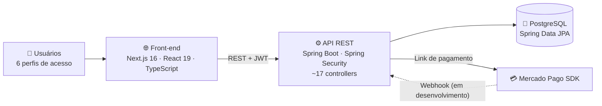

 

---

## 👨‍💻 Sobre mim

Estudante do **8º termo de Ciência da Computação na Unoeste** (Presidente Prudente, SP). Desenvolvo aplicações web full stack com **Java e Spring Boot** no back-end e **Next.js, React e TypeScript** no front-end.

Antes da computação, programei máquinas CNC na indústria e coordenei cronogramas de projetos audiovisuais. Foi lá que aprendi a trabalhar com prazo, precisão e gente.

- 🔭 **Construindo agora:** sistema de gestão da Paróquia São Miguel Arcanjo (voluntário)
- ⚙️ **Próximo passo nele:** confirmação automática de pagamentos via webhook do Mercado Pago
- 🎓 **Na faculdade:** TCC em visão computacional com redes neurais
- 🎯 **Buscando:** estágio em desenvolvimento

---

## 🚀 Projetos em destaque

### ⛪ Sistema de Gestão – Paróquia São Miguel Arcanjo
> 🟡 *Em desenvolvimento · Projeto voluntário · Desenvolvido sozinho, do banco ao front-end*

Sistema que vai atender secretaria, padre, coordenadores de pastorais e acampamentos e participantes de retiros.

<b>📋 Ver funcionalidades</b>

 

- 🔐 Autenticação com **Spring Security + JWT** e controle de acesso com 6 perfis (Coordenador Geral, Padre, Secretaria, Coordenador de Acampamento, Servo, Campista)
- ✅ Fluxo de aprovação de cadastros (ativo, inativo e pendente)
- 🏕️ Gestão de acampamentos com geração de links de pagamento via **Mercado Pago**
- 📦 Controle de estoque com entradas, saídas, transferências entre acampamentos e perdas por validade, com saldo recalculado automaticamente
- 📝 Formulários de inscrição dinâmicos: a coordenação cria as perguntas sem mexer no código
- ⛪ Cadastro de comunidades, pastorais, horários de missa e doações
- 📊 Dashboard com estatísticas e últimas movimentações
- 📖 API documentada com **Swagger/OpenAPI**

<!-- Se o repositório for público, descomente a linha abaixo com o link: -->
<!-- 🔗 **[Ver repositório](https://github.com/Victor200524/NOME-DO-REPO)** -->

---

### 🏭 Autoflex – Controle de Estoque e Planejamento de Produção
> 🟢 *Concluído · Desenvolvido como teste técnico para vaga Full Stack*

Calcula a produção máxima possível com o estoque disponível e **sugere o plano de produção de maior faturamento**, priorizando os produtos de maior valor.

-316192?style=flat-square&logo=postgresql&logoColor=white)

- Algoritmo de priorização baseado em valor e disponibilidade de insumos
- Histórico de produção persistente para rastrear estoque e faturamento
- Exportação de relatórios em PDF (jsPDF) e API documentada com Swagger

🔗 **[Ver repositório](https://github.com/Victor200524/NOME-DO-REPO)**

---

### 🧠 TCC – Estimativa de Volume Corporal a partir de Imagens 2D
> 🟡 *Em andamento · Trabalho de Conclusão de Curso*

Pipeline em **Python** que gera **1.000 avatares sintéticos** com o modelo **SMPL** e treina redes neurais **MLP** sobre medidas antropométricas para estimar o volume do corpo humano.

| Métrica | Melhor resultado |
|---|---|
| **R²** | 99,55% |
| **Erro médio (MAE)** | 0,90 litro |

🔗 **[Ver repositório](https://github.com/Victor200524/NOME-DO-REPO)**

---

## 🛠️ Stack

<table>
  <tr>
    <td><b>Back-end</b></td>
    <td>
      
      
      
      
    </td>
  </tr>
  <tr>
    <td><b>Front-end</b></td>
    <td>
      
      
      
      
    </td>
  </tr>
  <tr>
    <td><b>Banco de dados</b></td>
    <td>
      
      
    </td>
  </tr>
  <tr>
    <td><b>Ferramentas</b></td>
    <td>
      
      
      
      
    </td>
  </tr>
  <tr>
    <td><b>IA / Dados</b></td>
    <td>
      
      
    </td>
  </tr>
</table>

---

## 📚 Formação e certificações

- 🎓 **Bacharelado em Ciência da Computação** – Unoeste · 2023 – 2026
- ☁️ **Microsoft Azure Fundamentals (AZ-900)**
- 🍎 **Algoritmos e POO com Swift** – HackaTruck MakerSpace · 2025
- 🔧 **Aprendizagem Industrial em Mecânica de Usinagem** – SENAI · 2020 – 2021

---

## 🐍 Contribuições

<!-- Requer o workflow .github/workflows/snake.yml rodando. Se não for usar, apague esta seção inteira. -->
<picture>
  <source media="(prefers-color-scheme: dark)"  srcset="https://raw.githubusercontent.com/Victor200524/Victor200524/output/github-contribution-grid-snake-dark.svg"/>
  <source media="(prefers-color-scheme: light)" srcset="https://raw.githubusercontent.com/Victor200524/Victor200524/output/github-contribution-grid-snake.svg"/>
  
</picture>

---

### 💬 Vamos conversar?

Se você está contratando para **estágio em desenvolvimento**, me chama no [LinkedIn](https://www.linkedin.com/in/victor-hugo-donaire-de-oliveira-31b778165/) ou por [e-mail](mailto:victor.donaire@hotmail.com). 🤝

